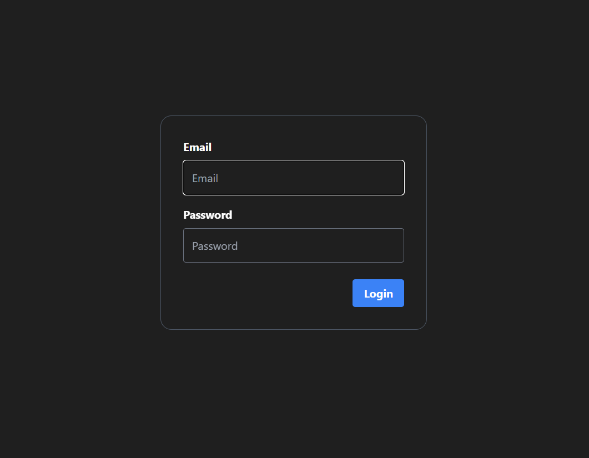

# Next js & Windi CSS


<br/>

# Execution
pnpm is package Manager

```bash
npm i -g pnpm
pnpm i
pnpm dev
```

<br/>


## Feature
- Persist Dark Mode
- Light Weight
- Attributify Grid


### NProgress
### Local Storage Store

<br/>

# Built with
- `Next.js` - React Framework
- `windiCSS` - Style Framework
  - Attributify Syntax
- `zustand` - State Manager

<br/>

# Code Styler
- `eslint` & `prettier` - linter & formatter
- `husky` - `git hook automation`


<br/>

# Design Pattern

- Atomic Design Pattern - Component Design Pattern


<br/>

